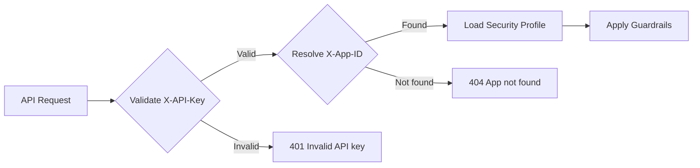

Protector Plus authenticates API calls using an **organization-wide API key** combined with an **App ID** to identify which application and security profile to apply.

## Authentication model

The current authentication architecture (1.1.x) uses a **per-app security profile model**:

- **Org-wide API key** — A single API key for your entire organization, generated in **Org Settings**
- **App ID** — A unique identifier for each registered application
- **Security Profile** — Each app is bound to a security profile that defines its guardrail configuration

### How it works



When you make an API call:
1. The system validates your `X-API-Key` against the org-wide credential
2. It looks up your app using `X-App-ID`
3. It retrieves the security profile bound to that app
4. It applies the guardrails configured in that profile

## Setting up authentication

### Step 1: Generate the org-wide API key

<Steps>
  <Step title="Navigate to Org Settings">
    Sign in as an admin → **Org Settings** in the dashboard sidebar.
  </Step>
  <Step title="Generate the API key">
    Click **Generate** to create your organization-wide API key.
  </Step>
  <Step title="Store the key securely">
    The key is shown once. Save it in a secrets manager — Vault, AWS Secrets Manager, GCP Secret Manager, Doppler, etc.
  </Step>
</Steps>

<Warning>
  The key is hashed (SHA-256) and stored securely. If lost, you must generate a new key, which will invalidate the previous one.
</Warning>

### Step 2: Register your application

<Steps>
  <Step title="Navigate to Apps">
    Dashboard → **Apps** → **Register App**.
  </Step>
  <Step title="Fill the registration form">
    - **App Name**: Human-readable name (e.g., "HR Chatbot")
    - **App ID**: Unique identifier (e.g., `hr-chatbot`, `customer-support-bot`)
    - **Security Profile**: Select which security profile to bind this app to
  </Step>
  <Step title="Save and note the App ID">
    Your App ID will be shown (masked as `app-••••` with a reveal button). Copy it for use in API calls.
  </Step>
</Steps>

<Tip>
  Multiple applications can share the same security profile. This is useful when you have several apps that need identical guardrail configurations.
</Tip>

## Using the API credentials

All authenticated endpoints require **both headers**:

```http
POST /apikey/api/protectorplus/v1/input-check HTTP/1.1
Host: <your-protector-plus-host>
Content-Type: application/json
X-API-Key: <YOUR_ORG_API_KEY>
X-App-ID: <YOUR_APP_ID>

{"message": "..."}
```

<Warning>
  **Both headers are required.** Providing only one will return a `401 Unauthorized` error.
</Warning>

### Error responses

| Scenario | HTTP Status | Response |
| --- | --- | --- |
| Missing or invalid `X-API-Key` | 401 | `{"error": "Invalid API key"}` |
| Missing or unknown `X-App-ID` | 404 | `{"error": "App not found"}` |
| Using only one header | 401 | `{"error": "Invalid API key"}` |

## Default security profile (optional)

You can omit the `X-App-ID` header if using a valid org-wide API key. In this case, Protector Plus will use the security profile marked as **default**.

```http
POST /apikey/api/protectorplus/v1/input-check HTTP/1.1
X-API-Key: <YOUR_ORG_API_KEY>

{"message": "..."}
```

<Note>
  If no security profile is marked as default, requests without `X-App-ID` will return `404 Default security profile not configured`.
</Note>

## Key scope and usage

| Scope | Effect |
| --- | --- |
| Organization-wide | One key authenticates all apps in your organization |
| Per-app isolation | Each app has its own App ID and security profile binding |
| Per-environment | Generate distinct keys for dev / staging / production |

## Rotation

To rotate your org-wide API key:

1. Generate a new key from **Org Settings**
2. Roll the new key into your applications' secret stores
3. Deploy your applications with the new key
4. Once all traffic has migrated, delete the old key from the dashboard

<Note>
  During rotation, you can temporarily have multiple keys active by generating a new one before deleting the old one.
</Note>

## Need an API key?

<Card title="Get an API key" icon="key" href="https://www.cloudsine.tech/contact">
  Request a sandbox key for evaluation or arrange a deeper technical conversation.
</Card>
