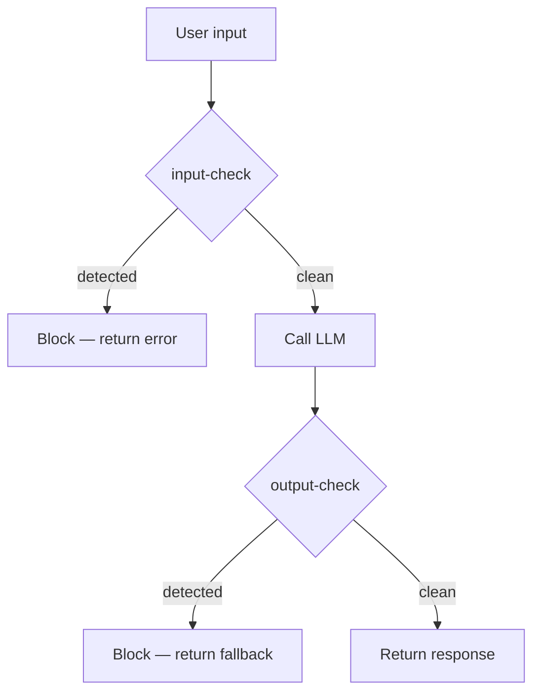

The recommended integration pattern is to call `input-check` **before** the LLM and `output-check` **on the response**.



## Streaming responses

For streaming LLM responses, forward **each chunk** to `output-check` as soon as it is received rather than waiting for the full response. This reduces time-to-detect for unsafe content and supports near-real-time handling decisions while output is still being generated.

## Reference implementation — Python

```python
import requests

BASE_URL = "https://<your-protector-plus-host>"
API_KEY  = "<YOUR_API_KEY>"
HEADERS  = {"Content-Type": "application/json", "X-API-Key": API_KEY}

def check_input(message: str) -> bool:
    """Returns True if safe, False if blocked."""
    r = requests.post(
        f"{BASE_URL}/apikey/api/protectorplus/v1/input-check",
        json={"message": message}, headers=HEADERS, timeout=30,
    )
    return not r.json().get("injection_detected", True)

def check_output(message: str, prompt: str | None = None) -> bool:
    """Returns True if safe, False if blocked."""
    payload = {"message": message}
    if prompt is not None:
        payload["prompt"] = prompt
    r = requests.post(
        f"{BASE_URL}/apikey/api/protectorplus/v1/output-check",
        json=payload, headers=HEADERS, timeout=30,
    )
    return not r.json().get("injection_detected", True)

# Usage
user_msg = "What is the capital of France?"

if not check_input(user_msg):
    print("Input blocked by firewall")
else:
    llm_response = call_your_llm(user_msg)   # your LLM call here
    if not check_output(llm_response, prompt=user_msg):
        print("Output blocked by firewall")
    else:
        print(llm_response)
```

## Reference implementation — Node / TypeScript

```typescript
const BASE_URL = "https://<your-protector-plus-host>";
const API_KEY  = process.env.PROTECTOR_PLUS_API_KEY!;

async function check(endpoint: string, body: Record<string, unknown>) {
  const res = await fetch(`${BASE_URL}/apikey/api/protectorplus/v1/${endpoint}`, {
    method: "POST",
    headers: { "Content-Type": "application/json", "X-API-Key": API_KEY },
    body: JSON.stringify(body),
  });
  return (await res.json()) as { injection_detected: boolean };
}

export const checkInput  = (m: string) =>
  check("input-check", { message: m }).then(r => !r.injection_detected);

export const checkOutput = (m: string, prompt?: string) =>
  check("output-check", prompt ? { message: m, prompt } : { message: m })
    .then(r => !r.injection_detected);
```

## Failure handling

Decide your **fail-open vs fail-closed** posture explicitly. Both are reasonable depending on threat model:

| Posture | Behaviour on Protector Plus error / timeout | When to choose |
| --- | --- | --- |
| Fail-closed | Block by default | High-assurance environments. Sensitive data flows. |
| Fail-open | Pass-through with logging | Latency-critical applications where availability dominates. |

Set a generous client timeout (the example uses 30 s) but track per-call latency and budget for the worst-case Protector Plus response in your end-to-end SLO.
