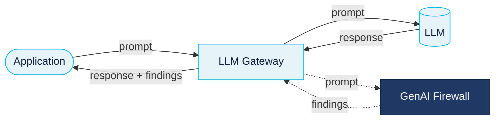
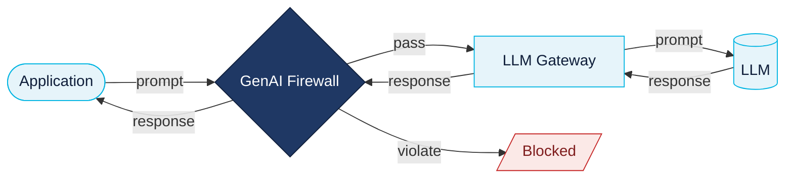
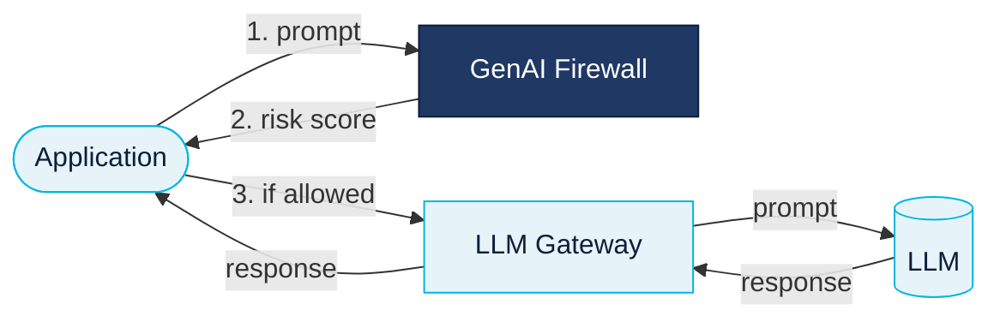

Protector Plus supports two enforcement topologies that define how the GenAI application routes prompts, where policy evaluation happens, and whether violations can prevent requests from reaching the LLM.

The gateway component shown in the diagrams below is a reference LLM gateway — **any compatible gateway** can be used in its place.

## Gateway-first (non-blocking)

The GenAI application sends prompts to an LLM gateway, which forwards them concurrently to the LLM and to the GenAI Firewall for evaluation. The firewall returns findings alongside the LLM response; the application interprets findings and decides whether to allow, suppress, log, or alert.

<Info>
  Non-blocking by design — the application retains the final allow/deny decision.
</Info>

## Forwarding mode (firewall-first, blocking)

The GenAI Firewall sits inline as an enforcing gate. Prompts that pass policy checks are forwarded to the gateway and on to the LLM; violating prompts are blocked and never reach the model.

<Tip>
  Forwarding mode is the recommended topology for production deployments under strict policy enforcement.
</Tip>

## Non-forwarding mode (firewall-first, app-decides)

The firewall receives the prompt first and evaluates it, but does not forward to the LLM. It returns a risk score to the application; the application makes the final allow/deny decision and, if proceeding, calls the LLM directly through its own gateway.

## Decision matrix

| Category | Gateway-first | Forwarding | Non-forwarding |
| --- | --- | --- | --- |
| First hop from app | Gateway | GenAI Firewall | GenAI Firewall |
| Enforcement | Non-blocking | Blocking | Non-blocking |
| Final allow/deny authority | App or gateway | GenAI Firewall | App |
| Can stop violating prompt? | No | Yes | Only if app chooses not to forward |
| Integration effort | Low | Low | Medium |
| Security-profile model | Shared default (unless gateway forwards an app ID) | Application-specific by default | Application-specific by default |

## Per-application security profiles

In **Forwarding** and **Non-forwarding** modes, every request reaches the firewall directly so per-application security profiles work out of the box.

In **Gateway-first** mode, per-application profiles require the gateway to propagate a unique application identifier with each request. Without it, Protector Plus applies the default profile.
