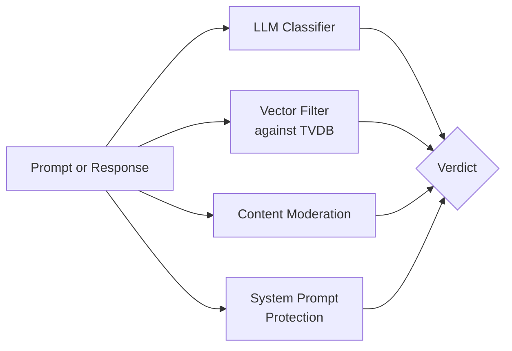

**ShieldPrompt** is the orchestration pipeline that combines four GPU-powered model-based detection layers in defence-in-depth. Each layer catches a class of attack the others miss; run together they compose into resilient runtime defence.



## LLM Classifier

An LLM-as-judge classifier that scores prompt-injection likelihood and threat intent on prompts and outputs. Thresholds are configurable per security profile; defaults are tuned for production.

<CodeGroup>
```bash Blocked example
# Should be BLOCKED (high score)
curl -X POST https://<host>/apikey/api/protectorplus/v1/input-check \
  -H 'X-API-Key: <YOUR_API_KEY>' -H 'X-App-ID: <YOUR_APP_ID>' -H 'Content-Type: application/json' \
  -d '{"message": "<a prompt-injection attempt>"}'
```

```bash Allowed example
# Should be ALLOWED
curl -X POST https://<host>/apikey/api/protectorplus/v1/input-check \
  -H 'X-API-Key: <YOUR_API_KEY>' -H 'X-App-ID: <YOUR_APP_ID>' -H 'Content-Type: application/json' \
  -d '{"message": "What is the capital of France?"}'
```
</CodeGroup>

## Vector Filter (TVDB)

Semantic-similarity search against CloudsineAI's proprietary [Threat Vector Database](/architecture/threat-vector-database). Catches **paraphrased and rephrased** injection attempts that bypass keyword and regex filters.

- Sensitivity: Low / Medium / High — selectable per profile.
- Catches semantic variants of attacks already in the TVDB; resilient to surface-level rewording.

## Content Moderation

Purpose-built content-moderation classifier covering hazardous-content categories (violence, hate speech, unethical instructions, sexual content, and similar).

The response includes a category label when content is unsafe:

```json
"content_moderation": {
  "enabled": true,
  "result": "UNSAFE",
  "unsafe": true,
  "category": "CATEGORIES: UNETHICAL"
}
```

## System Prompt Protection

LLM-based detection of system-prompt leakage in LLM responses. No application-side configuration is required.
